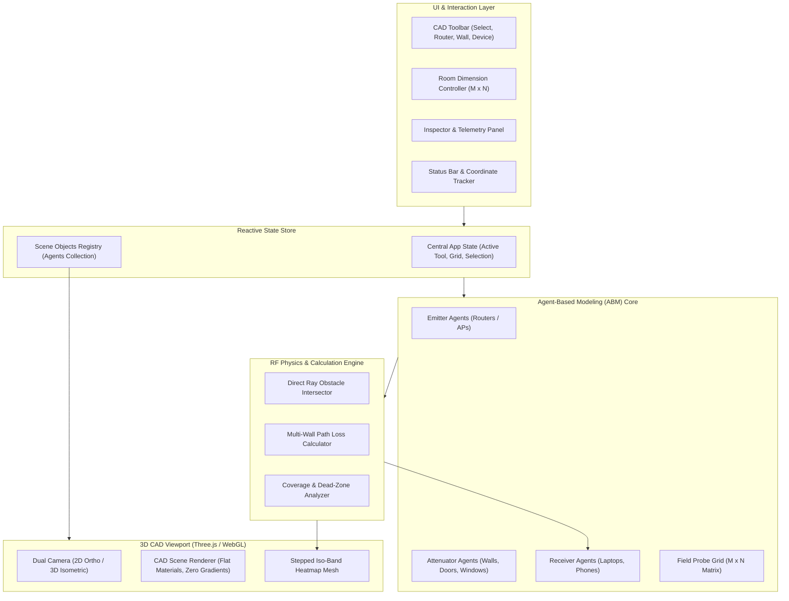

# ARCHITECTURE.md — System Architecture & Agent-Based Design

This document details the software architecture, data flow, component hierarchy, and Agent-Based Modeling (ABM) design for the **3D CAD WiFi Simulator**.

---

## 1. High-Level Architectural Diagram



---

## 2. Agent-Based Modeling (ABM) Hierarchy

The simulation models the wireless physical environment as discrete interacting agents:

```
[Agent Base Class]
  ├── id: string
  ├── position: Vector3 (x, y, z in meters)
  ├── isDirty: boolean
  │
  ├── [EmitterAgent] (e.g., WiFi Router, Extender)
  │     ├── txPowerDbm: number (e.g., 20 dBm)
  │     ├── frequencyGHz: 2.4 | 5.0 | 6.0
  │     ├── channel: number
  │     └── antennaGainDbi: number (e.g., 3 dBi)
  │
  ├── [AttenuatorAgent] (e.g., Wall, Door, Window)
  │     ├── startPoint: Vector2 (x1, y1)
  │     ├── endPoint: Vector2 (x2, y2)
  │     ├── height: number (e.g., 2.8m)
  │     ├── thickness: number (e.g., 0.15m)
  │     ├── materialType: 'concrete' | 'brick' | 'drywall' | 'wood' | 'glass' | 'metal'
  │     └── attenuationDb: number (calculated per material & frequency)
  │
  ├── [ReceiverAgent] (e.g., Laptop, Smartphone, Smart TV)
  │     ├── deviceType: 'laptop' | 'smartphone' | 'tv' | 'iot'
  │     ├── rxSensitivityDbm: number (threshold cutoff, e.g., -85 dBm)
  │     ├── currentRssiDbm: number (live calculated)
  │     ├── linkSpeedEstimateMbps: number
  │     └── status: 'excellent' | 'good' | 'fair' | 'poor' | 'disconnected'
  │
  └── [ProbeAgent] (Dense virtual sensor grid)
        ├── sampleStep: number (e.g., 0.25m or 0.50m resolution)
        └── rssiMatrix: Float32Array (used to colorize the stepped contour heatmap)
```

---

## 3. Calculation Pipeline (Event-Driven Loop)

1. **Agent Modification:** User places, drags, or modifies any agent (e.g., shifts router coordinates or changes a wall material from drywall to concrete).
2. **Flag Dirty State:** The modified agent and the global spatial index are marked `isDirty = true`.
3. **Ray-Wall Intersection:** For each receiver device (and probe grid points):
   - Cast a 2D line segment from Router $(x_r, y_r)$ to Target $(x_t, y_t)$.
   - Compute intersections with all `AttenuatorAgent` line segments using fast 2D cross-product line-intersection math.
4. **Path Loss Evaluation:**
   - Compute Free-Space Path Loss ($FSPL$) across Euclidean distance $d$.
   - Accumulate total material attenuation $\sum A_{\text{wall}}$ from all intersected walls.
   - Calculate Received Signal Strength Indicator:
     $$\text{RSSI} = P_{\text{tx}} + G_{\text{tx}} - FSPL(d, f) - \sum A_{\text{wall}}$$
5. **Discrete Contour Generation:**
   - Map RSSI values into discrete stepped color zones ($<-85$, $-85\dots-75$, $-75\dots-65$, $-65\dots-50$, $\ge -50$).
   - Update 3D heatmap plane vertex colors (flat shading, zero smooth gradients).
6. **UI Telemetry Refresh:** Update property inspector panels and device badges.

---

## 4. Proposed Codebase Structure

```
wifi_simulator/
├── .git/
├── agents/                      # Project blueprints & documentation (Single Source of Truth)
│   ├── AGENTS.md
│   ├── DESIGN.md
│   ├── PRD.md
│   ├── ARCHITECTURE.md
│   ├── SPECS.md
│   └── TASKS.md
├── index.html                   # CAD Application Entry Point
├── package.json                 # Minimal dependencies (Vite + Three.js)
├── src/
│   ├── main.js                  # App bootstrap & event wiring
│   ├── style.css                # Clean CAD UI styles (Zero gradients)
│   ├── core/
│   │   ├── State.js             # Reactive application state
│   │   ├── EventBus.js          # Decoupled communication
│   │   └── SpatialIndex.js      # 2D Grid / Quadtree for fast collision
│   ├── agents/
│   │   ├── Agent.js             # Base Agent class
│   │   ├── EmitterAgent.js      # Router / AP entity
│   │   ├── AttenuatorAgent.js   # Wall / Door / Window entity
│   │   └── ReceiverAgent.js     # Client devices entity
│   ├── physics/
│   │   ├── RfEngine.js          # RF calculation orchestrator
│   │   ├── PathLossModel.js     # FSPL + Multi-Wall math
│   │   ├── Intersection2D.js    # Fast line-segment intersection
│   │   └── Materials.js         # Physical RF attenuation constants
│   ├── viewport/
│   │   ├── CADViewport.js       # Three.js canvas & render loop
│   │   ├── CADCamera.js         # Orbit & Ortho camera controller
│   │   ├── GridManager.js       # Dynamic MxN metric grid & axes
│   │   ├── ObjectRenderer.js    # 3D meshes for walls, router, devices
│   │   └── HeatmapRenderer.js   # Discrete stepped iso-band heatmap plane
│   └── ui/
│       ├── Toolbar.js           # CAD tool switcher
│       ├── DimensionDialog.js   # MxN room sizing modal
│       ├── InspectorPanel.js    # Selected agent properties
│       └── StatusOverlay.js     # Real-time coordinates & stats
```

---

## 5. Performance Optimizations
- **Spatial Subdivision:** Use a lightweight uniform grid to prune wall intersection tests so only walls inside the bounding box between the router and target are evaluated.
- **Adaptive Probe Density:** Compute a coarse grid ($0.5\text{ m}$) during dynamic user dragging, refining to a fine grid ($0.2\text{ m}$) upon release.
- **Shader / Canvas Texture Updates:** Transfer calculated RSSI values as a 2D scalar field to update the CAD heatmap plane efficiently without rebuilding geometry.
